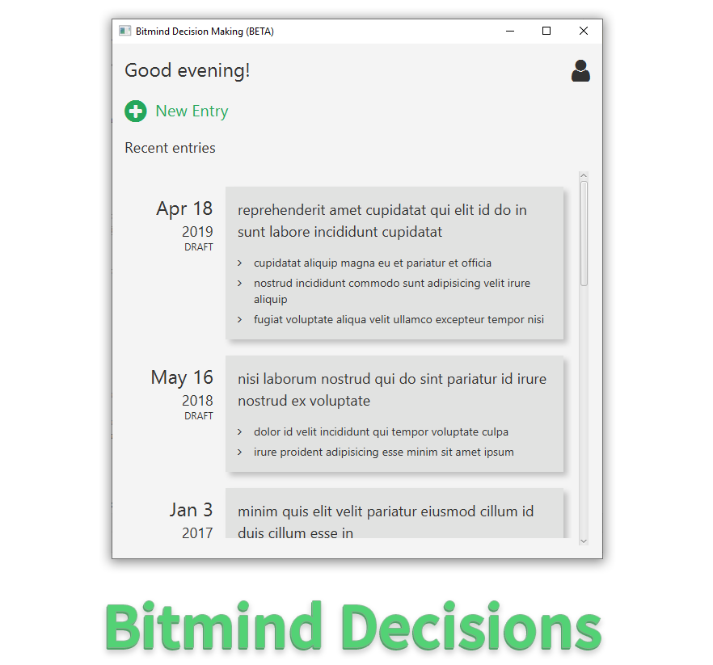

# Bitmind - Decision Making Assistant (University Project)



**[Read a detailed write-up of this project at my website! (peytonseigo.ca)](https://peytonseigo.ca/bitmind/)**

## Development instructions using the IntelliJ IDE

1. Install the Java 11 JDK.
2. Install the [JavaFX library](https://openjfx.io/) (it's no longer bundled with the JDK).
3. Load the project.
4. `File > Project Structure... > Project > Project SDK`: Set to Java 11. Click `OK`.
5. Right click and run the source file: `src/main/ca.ubc.cs.cpsc210/ui/App.java` so it appears in Configurations in the top right.
6. Click the Configurations dropdown and click `Edit Configurations...`.
7. Add the following to `VM options`:

```bash
--module-path ${JAVAFX_LIB_PATH}
--add-modules javafx.controls,javafx.fxml,javafx.graphics
--add-exports=javafx.graphics/com.sun.javafx.css=ALL-UNNAMED
```

Set an environment variable called `JAVAFX_LIB_PATH` or replace `${JAVAFX_LIB_PATH}` with the path to your JavaFX installation.

On my Windows machine, I installed JavaFX at `C:\lib\javafx-sdk-11.0.2\lib`. On my Linux machine, I installed it at `/usr/share/java/`.

8. You're ready to go. Build and have fun!
    - Tip: You can clean the build using `Build > Build Artifacts... > Clean`.
